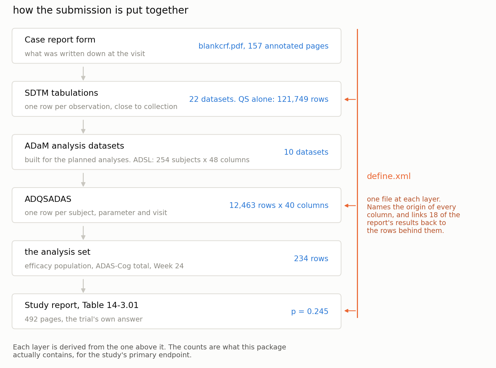
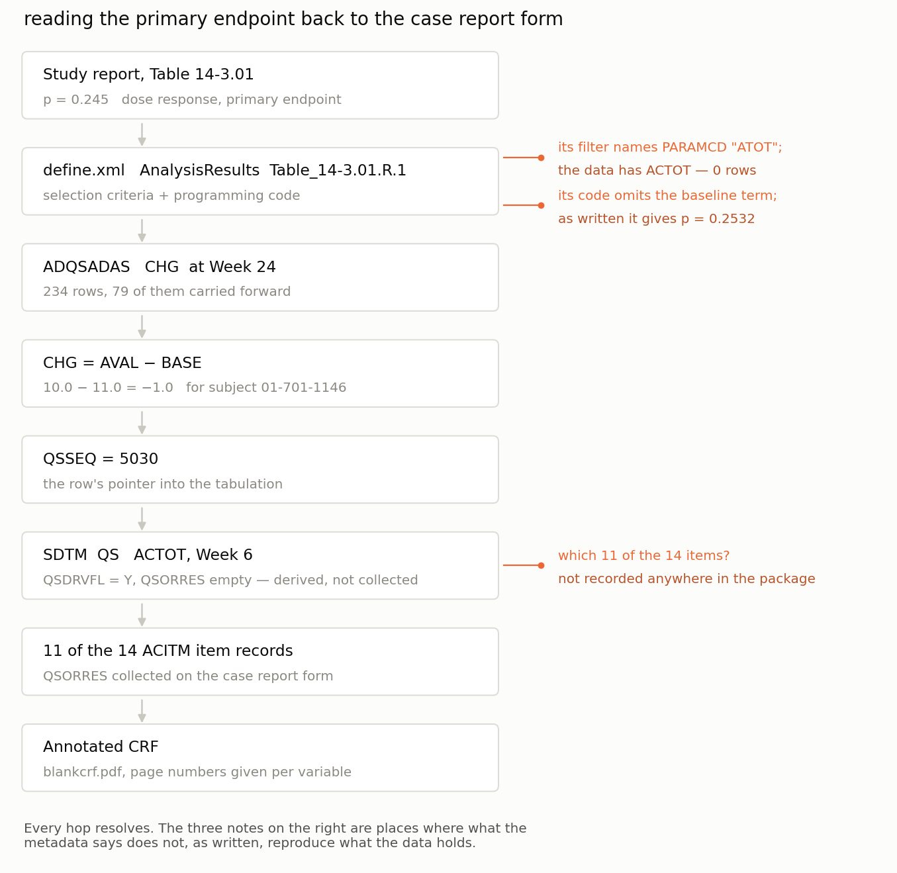
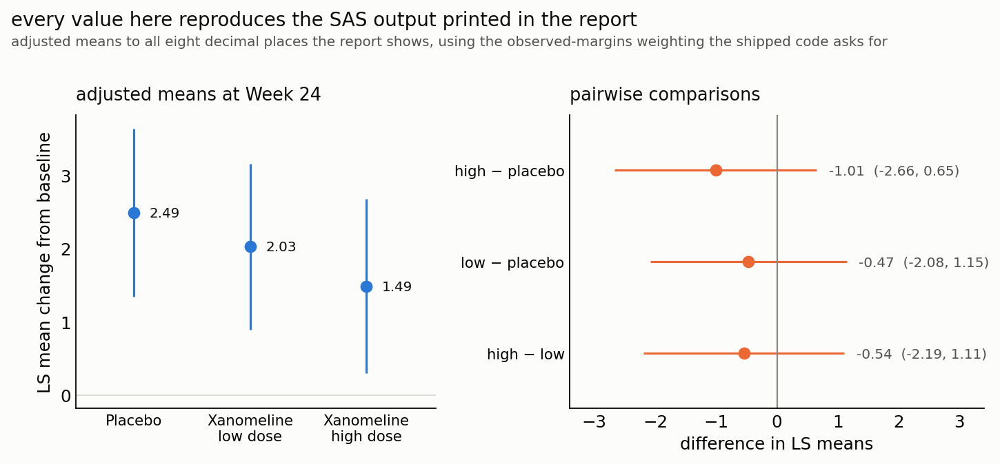
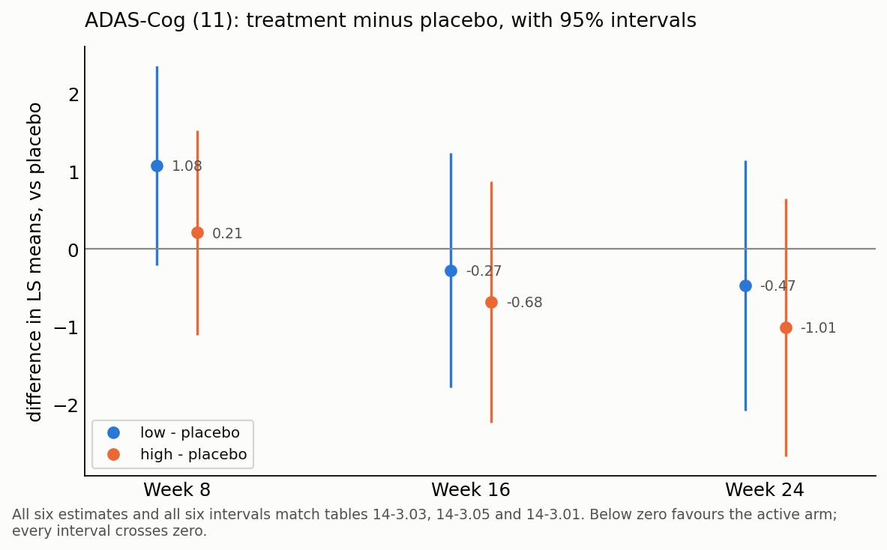
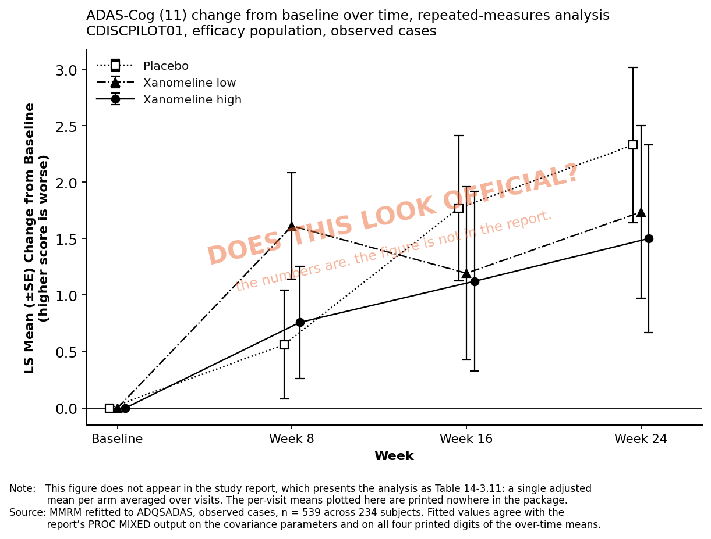

# 03 — Reading a reported number back to the case report form

The CDISC SDTM/ADaM Pilot Project is a complete public submission for a fictional
Alzheimer's study: annotated CRF, SDTM tabulations, ADaM analysis datasets, `define.xml` at
both levels, and a 492-page study report containing the actual tables. Every link between a
collected value and a printed number is present, which is what makes the walk-back possible
from outside a sponsor.

Those analysis datasets were built to answer one pre-specified question, and the decisions
behind them are written down but not carried by the tables themselves. The notebook rebuilds
the study's primary endpoint from Table 14-3.01, ADAS-Cog (11) change from baseline to Week 24,
dose-response **p = 0.245**, and agreement is what confirms those decisions have been read as
intended. It then sorts all 88 columns by what each can be used for.

## Running it

Nothing is committed except the notebook's outputs, its five figures and three CSVs; the
package is downloaded. From this directory:

```bash
python3 -m venv .venv && .venv/bin/pip install -r requirements.txt
./setup.sh
```

Then open it and work through it:

```bash
.venv/bin/jupyter lab notebook.ipynb
```

or re-run every cell headlessly, rewriting the outputs and the PNGs in `figures/`:

```bash
.venv/bin/jupyter nbconvert --to notebook --execute --inplace notebook.ipynb
```

The second exits non-zero if any cell raises, so it doubles as the check that the notebook
still runs. Start from this directory; the paths inside are relative to it. The first code
cell prints `all 13 input files present`; if it doesn't, stop there.

The run takes about **11 seconds** and is deterministic: no seed, no model, no sampling, so
two runs are byte-identical. Outputs are committed anyway, so the notebook can be read
without running it. That only stays honest if the committed outputs match the committed
code, so **Restart Kernel and Run All Cells (or the `nbconvert` line) before committing an
edit**; non-consecutive execution counts in the committed file mean someone skipped it.

`setup.sh` is re-runnable and skips whatever it already has. It fetches **13 files, 88 MB**
from `raw.githubusercontent.com`, pinned to commit `667511d4` of
[cdisc-org/sdtm-adam-pilot-project](https://github.com/cdisc-org/sdtm-adam-pilot-project),
and warns if any checksum has drifted from the version these numbers came from. Cloning the
whole repository also works but pulls ~400 MB, most of it SAS transport copies of datasets
that also ship as Dataset-JSON. The JSON needs no special reader, so that is what the
notebook opens. No SAS and no JDK; pandas, statsmodels, matplotlib and pypdf, all from pip.

The data is CDISC's, published for public use with attribution, and is not redistributed
here.

## What you should get

The package is layered, and each layer narrows:



**The chain closes, exactly.** Rebuilt from the shipped ADaM data, every figure in
Table 14-3.01 matches the study report to the precision it was printed at:

| | study report | notebook |
|---|---|---|
| n (placebo / low / high) | 79 / 81 / 74 | 79 / 81 / 74 |
| mean change from baseline | 2.5 / 2.0 / 1.5 | 2.54 / 2.00 / 1.47 |
| p, dose response | 0.245 | 0.2447 |
| low − placebo, diff (SE), p | −0.5 (0.82), 0.569 | −0.47 (0.82), 0.569 |
| high − placebo | −1.0 (0.84), 0.233 | −1.01 (0.84), 0.233 |
| high − low | −0.5 (0.84), 0.520 | −0.54 (0.84), 0.520 |

Because the reconstruction is exact, the observations below are about the documentation
rather than about how the notebook modelled it.

**What the rebuild required.** The specification is spread across the analysis metadata, the
report's footnotes and its printed statistical output. Each is partial on its own.

1. *Table 14-3.01, both results.* The selection criteria and the SAS both name
   `PARAMCD="ATOT"`. The dataset has no such parameter; it is `ACTOT`, and the correct code
   appears in the same element's parameter list. Run the documented filter and 0 of 12,463
   rows come back. Executing all thirty declared (result, dataset) pairs, four select
   nothing.
2. *Table 14-3.01, the model.* The code in `define.xml` reads
   `class sitegr1; model CHG = trtpn sitegr1;`, with no baseline term; the table's footnote
   states baseline as a covariate. Fitting the first gives **p = 0.2532**, the second
   **0.2447**, which is the printed 0.245. The raw PROC GLM output eight pages further on
   carries `BASE` with its own degree of freedom and Type III sum of squares. Neither partial
   specification raises an error.
3. *`ACTOT` in SDTM.* The analysis row's `QSSEQ` pointer resolves cleanly to one tabulation
   record: for the subject shown, a Week 6 value carried forward, one of 79 LOCF rows out of
   234. That record is flagged derived, with no collected result. Its 14 sibling item
   records sum to 51, not 10, because ADAS-Cog (**11**) uses eleven of them. Which eleven is
   not recorded anywhere machine-readable in the package; the notebook recovers it by
   solving across all 778 complete visits, which gives a unique answer (excluding delayed
   word recall, attention/visual search, and maze solution).

A fourth, smaller one, in Table 14-3.12: the filter asks for `AVISIT="Weeks 4-24"` and the
stored value is `"      Weeks 4-24"`, right-justified. Display formatting reached the data,
and the metadata describes the intended value.

The notebook lifts the table out of the report PDF rather than quoting it, so the footnotes
are visible too, including the one naming the program that produced it,
`C:\cdisc_pilot\PROGRAMS\DRAFT\TFLs\rtf_eff1.sas`. The package ships two SAS programs, and
that is not one of them. Table 14-3.01 appears twice in the report, and the second copy
names a different program run seven months later,
`C:\cdisc_pilot\CFB_revisions\programs\rtf_eff1__.sas`. Every number in the two copies is
identical.



**The specification is precise where it is complete.** Because the report prints the full PROC GLM
output, the analysis can be checked against something far more exacting than a rounded
p-value, and it holds everywhere:

| | notebook | SAS output |
|---|---|---|
| dose model, error SS | 5854.045839 | 5854.045839 |
| dose model, root MSE | 5.146736 | 5.146736 |
| type III SS: TRTDOSE / SITEGRP / BASE | 36.0384965 / 556.3851128 / 3.0136824 | identical |
| comparison model, error SS | 5851.967689 | 5851.967689 |
| LS means, high / low / placebo | 1.48854043 / 2.02777167 / 2.49455402 | identical |

That last row is the interesting one. The shipped code asks for `lsmeans trtpn / OM`, and
the `OM` is load-bearing: observed-margins weighting averages the site-group term by how
many subjects each of the eleven sites contributed, and reproduces the printed LS means to
all eight decimals. The default equal weighting gives 1.46766200 / 2.00689324 / 2.47367560
, differing in the second decimal. An option most readers would skim past is what brings the
values to the last printed digit.



**How far the reproduction goes.** Week 24 is one of three: the same ANCOVA was run at
Weeks 8 and 16 and printed as tables 14-3.03 and 14-3.05. Refitting at each visit gives
twelve checks, three dose-response p-values and nine pairwise differences with their
standard errors, and all twelve match. That is enough to draw the endpoint over time.



Every point and every interval on that plot has a printed counterpart. Per-arm adjusted
means are deliberately not drawn: at Weeks 8 and 16 the report prints none to check them
against, and the repeated-measures model below gives that trajectory properly.

The repeated-measures analysis behind table 14-3.11 reproduces as well, which is less
obvious, since it is REML with an unstructured covariance across the three visits. The estimates
land exactly:

| | notebook | SAS PROC MIXED |
|---|---|---|
| LS means (placebo / low / high) | 1.5535 / 1.5136 / 1.1270 | 1.5535 / 1.5136 / 1.1270 |
| standard errors | 0.4924 / 0.5226 / 0.5541 | 0.4930 / 0.5236 / 0.5552 |
| covariance UN(1,1) / UN(2,2) / UN(3,3) | 16.8213 / 28.2586 / 31.3947 | 16.8209 / 28.2581 / 31.3944 |

The standard errors sit about 0.2% low, and the report explains that itself: its Model
Information block names Kenward-Roger degrees of freedom and a
Prasad-Rao-Jeske-Kackar-Harville small-sample correction, and statsmodels implements
neither. Knowing why a number differs is what the printed SAS output buys here; `define.xml` has no
entry for this table at all.

(One wrinkle worth noting if you extend this: statsmodels splits the covariance into a
random-effect matrix plus a residual variance, so the residual scale has to be added back
to the diagonal before it can be compared with SAS's `UN`. The off-diagonals need no such
adjustment.)

None of this changes the study's conclusions, and none of it needs to be read as a criticism
of the package. It is a 2013 update of a 2007 pilot, published as a teaching example, and
it is the only reason any of this could be checked from outside.

The repeated-measures model carries a treatment-by-visit interaction, so it gives a mean per
arm per visit directly. Drawn the way a review would draw it:



The three curves average, over time, to the values Table 14-3.11 prints, and those match
exactly. The individual visit means are not printed anywhere, so they are the model's
output rather than a reproduction.

Reading that figure correctly takes facts that are not on it: the subject count per arm per
visit, and why people left. Both live elsewhere in the package, in the disposition data, in
`DTYPE`, and in the SAP's choice of imputation. The write-up works through what the figure
does and does not support.

## What the columns actually are

The point of doing all of that is not the p-value. It is that you end up knowing what each
column is, which is the question to answer before any of this becomes a training set.

ADSL is one row per subject, 48 columns, no missing-data mess. It looks like a feature table
somebody already cleaned for you.

The field that should settle it does not. **Every one of the 88 columns across ADSL and
ADQSADAS has `Origin="Derived"`** in the ADaM `define.xml`, so the machine-readable provenance
field says the same thing about all of them. Only the free-text `Comment` varies. The SDTM
`define.xml` is the opposite: its `Origin` takes real values (`CRF Page 7`, `Assigned`,
`eDT`, `Derived`), which is why a trace that reaches SDTM can sometimes carry on to a page
of the case report form.

So the sorting leans on the `Comment` text, on which variables the analysis results metadata
names, and, where neither settles it, on when the value could first have been known:

| | ADSL | ADQSADAS |
|---|---|---|
| **feature**, fixed at or before randomisation | 23 | 11 |
| **result**, determined by what happened after | 19 | 6 |
| **technical**, identifiers, windows, record flags | 6 | 23 |

**Nineteen of ADSL's 48 columns are results.** Several do not look like it. `TRTDUR` is a
duration, `AVGDD` is a dose, `COMP24FL` is a Y/N flag, and each is a function of when the
subject stopped, which is what a dropout or outcome model would be trying to predict:

| column | why it is a result | what `define.xml` says |
|---|---|---|
| `TRTDUR` | encodes time on drug | `TRTEDT-TRTSDT+1` |
| `AVGDD` | inherits `TRTDUR` | `CUMDOSE/TRTDUR` |
| `CUMDOSE` | accumulates over time on drug | `For ARMN=0 or 1: CUMDOSE=TRT01PN*TRTDUR …` |
| `COMP24FL` | the discontinuation outcome in disguise | `Y if subject has a SV.VISITNUM=12 and ENDDT>= date of visit 12` |
| `EFFFL` | requires post-baseline records to exist | `Y if SAFFL='Y' AND subject has at least one record in QS …` |
| `SAFFL` | requires a treatment start date | `Y if ITTFL='Y' and TRTSDT ne missing` |
| `DISCONFL` / `DSRAEFL` / `DCREASCD` | disposition | `Y if DCREASCD ^= 'Completed'`, etc. |

The full sort is in [`column-roles.csv`](column-roles.csv): 88 rows, and for each one the
role, why it got that role, the derivation `define.xml` states, what it traces to, and where
that lands in the source. The features that make it all the way to a CRF page look like this:

```
ADSL.RACE      -> DM.RACE      -> CRF Page 7
ADSL.SEX       -> DM.SEX       -> CRF Page 7
ADSL.DISONSDT  -> MH.MHSTDTC   -> CRF Pages 12, 14
ADSL.MMSETOT   -> QS.QSORRES   -> CRF Pages 10, 11, 26, 27, ...
```

Most do not. `where_in_the_source` is blank or `Derived` more often than it is a page number,
because the trace reaches SDTM and stops there, the SDTM value being itself derived, the same
wall `ACTOT` ran into. And one predecessor reference points at a variable that is not there:
`ADQSADAS.EFFFL` names `ADSL.FASFL`, and ADSL has no `FASFL`. Running the checks is what
surfaces that; reading alone does not.

## The table to actually train on

Sorting the columns is the work; the deliverable is a flat table that carries the sorting
with it. [`analysis-table.csv`](analysis-table.csv) is **254 rows, one per randomised
subject, and 71 columns**, with each visit of a repeated measure in its own column.

Three efficacy endpoints go in wide, at the visits the report analyses them at, taking the
record each analysis actually used (`ANL01FL='Y'`):

| | | |
|---|---|---|
| `ADAS_AVAL_BASE` | feature | ADAS-Cog (11) before the first dose |
| `ADAS_AVAL_W08` … `_W24`, `ADAS_CHG_W08` … `_W24` | result | the primary endpoint at each visit |
| `ADAS_LOCF_W08` … `_W24` | result | 1 when the value was carried forward |
| `CIBIC_AVAL_W08` … `_W24`, `CIBIC_LOCF_W16`/`_W24` | result | CIBIC+ |
| `NPI_AVAL_BASE` | feature | NPI-X total before the first dose |
| `NPI_AVAL_W08` … `_W24`, `NPI_CHG_W08` … `_W24`, `NPI_AVAL_W04_24` | result | NPI-X, including the Weeks 4–24 mean the SAP defines |

plus the 25 baseline features and 6 identifiers from ADSL. Roles across the whole table:
**25 feature, 40 result, 6 technical**. [`analysis-table-dictionary.csv`](analysis-table-dictionary.csv)
carries one row per column with the role, the reason, the derivation `define.xml` states,
and where it traces to.

The reshaping is checked rather than assumed: 234 subjects with `EFFFL='Y'`, 234 non-missing
`ADAS_CHG_W24`, 79 of them carried forward, and arm means of 2.54 / 2.00 / 1.47, all of
which the report also prints.

Two things in this table are worth more than the rest of it.

**The carried-forward flags are dropout labels.** `ADAS_LOCF_W24` is 1 for 79 of the 234
analysed subjects, and it is 1 exactly when the subject stopped coming. A model handed that
column as an input will find it useful for a reason that has nothing to do with the drug.

**The three endpoints disagree about missingness, and the table shows it:**

```
ADAS_AVAL_W24    234 present,   0 missing     (LOCF-filled)
CIBIC_AVAL_W24   234 present,   0 missing     (LOCF-filled)
NPI_AVAL_W24     121 present, 113 missing     (observed only)
```

Same study, same subjects, same 24 weeks. Two endpoints were carried forward and one was
not, so half the NPI-X column is absent while the ADAS-Cog column looks complete. Nothing
in the column names says which is which. `DTYPE` does, and the dictionary carries it
forward. That is the whole argument in one line: the values do not tell you what they are,
and the metadata beside them does.

To use it: `X` = the columns whose role is `feature`, `y` = one column whose role is
`result`, and every other `result` column comes out of `X`. The role assignment is a
judgement call, not something the package states; the dictionary gives the evidence for each
one so it can be argued with.

## Reclaiming the disk afterwards

A full run leaves **88 MB** under `data/`, all of it re-downloadable:

| | |
|---|---|
| `data/adam/` | 58 MB, nine analysis datasets and the ADaM `define.xml` |
| `data/sdtm/` | 24 MB, the QS tabulation and the SDTM `define.xml` |
| `data/csr/` | 5.7 MB, the study report |

The figures, the three CSVs and the notebook's embedded outputs are the durable
artifacts, so:

```bash
rm -rf data
```

Re-running `./setup.sh` fetches it again in under a minute on a normal connection.
